# 🔍 MetaLens — AI Data Governance Copilot

> Upload Excel → OpenMetadata flags PII → AI explains what breaks → Data quality scored → Full lineage shown.
> **What takes a data steward 3 hours now takes 30 seconds.**

Built for the **WeMakeDevs x OpenMetadata Hackathon (Apr 17–26, 2026)**

🔗 **Live Demo:** [metalens-production.up.railway.app](https://metalens-production.up.railway.app)
📦 **GitHub:** [pratyakshyamishra43-coder/MetaLens](https://github.com/pratyakshyamishra43-coder/MetaLens)

---

## 🚨 The Problem

Data teams work with Excel files daily but have no easy way to:
- Know which columns contain sensitive (PII) data
- Understand what downstream pipelines break if a column is modified
- Get a plain-English explanation of what the data means
- Assess data quality without writing custom scripts
- Generate compliance reports for GDPR/HIPAA audits

---

## ✅ The Solution

MetaLens connects your Excel file to OpenMetadata's governance layer and uses AI to answer all of this instantly.

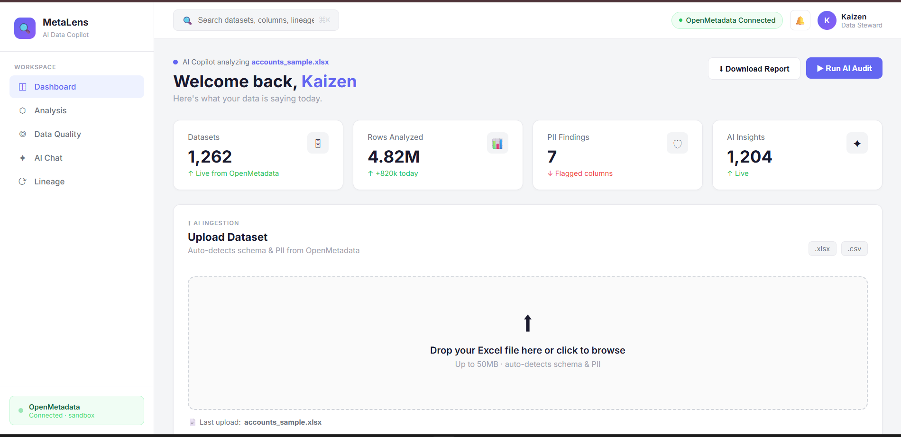

---

## 🎯 Core Demo Flow
1. Upload any `.xlsx` file on the dashboard
2. MetaLens matches your columns to OpenMetadata tables
3. PII columns are flagged and masked automatically
4. AI explains your data, scores quality, and shows lineage
5. Ask follow-up questions in the AI Chat

---

## ✨ Features

### ✅ Shipped
| Feature | Description |
|---|---|
| 🛡 PII Detection | Auto-flags Sensitive & NonSensitive columns from OpenMetadata tags |
| 🔒 PII Masking | Sensitive column values masked as `*** MASKED ***` in preview |
| 🤖 AI Copilot Chat | Ask questions about your data in plain English |
| 📊 Data Quality Score | Circular score (0–100) with null, PII risk & completeness breakdown |
| 🔗 Lineage View | Upstream/downstream table dependencies from OpenMetadata |
| 🔍 Table Search | Search any table across OpenMetadata catalog live |
| 🌐 Live Deployment | Hosted on Railway, accessible via public URL |

### 🔄 In Progress (Apr 22–25)
| Feature | Description |
|---|---|
| 💥 Column Impact Analyzer | "What breaks if I delete this column?" dedicated input + impact score (1–10) |
| 🏷 DataSensitivity Badges | OpenMetadata Tags API — DataSensitivity & DataTier badges per column |
| 🔗 Column-level Lineage | Trace individual column dependencies across tables |
| ✅ Metadata Completeness | Check how complete your OpenMetadata table descriptions are |
| 🧩 Smart Table Matcher | Auto-match uploaded Excel columns to best OpenMetadata table |
| 📄 PDF Export | Download full analysis as a professional PDF report |
| ✏️ Table Description Editor | Write descriptions back to OpenMetadata directly from MetaLens |
| 📋 Compliance Report | Auto-generate GDPR/HIPAA compliance report from PII findings |
| 🔎 Bulk PII Scanner | Scan multiple tables at once for PII exposure |

---


**Walkthrough

**1. Dashboard — Upload your Excel file to begin analysis**


**2. Analysis — Columns matched to OpenMetadata; PII auto-detected and masked**
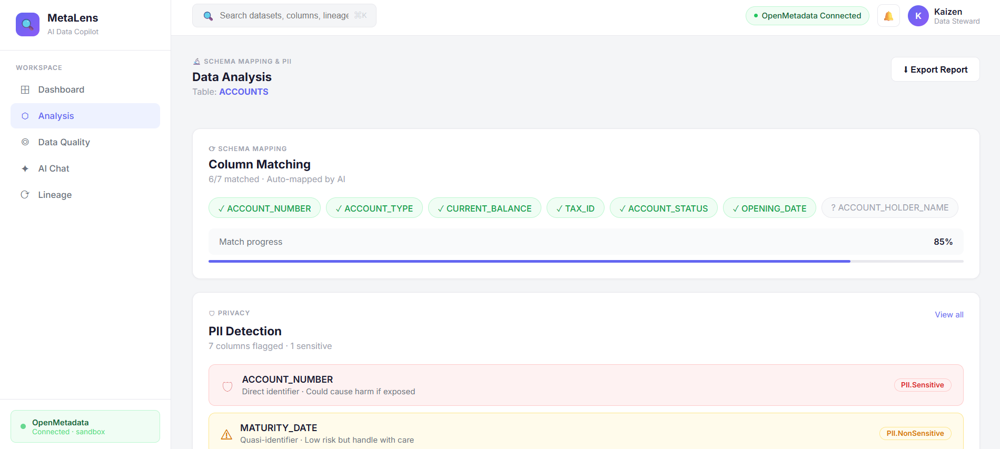 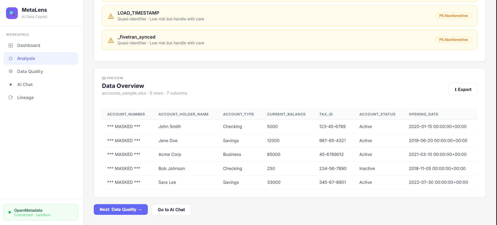

**3. Impact Scores — Every column scored 1–10 for deletion risk**
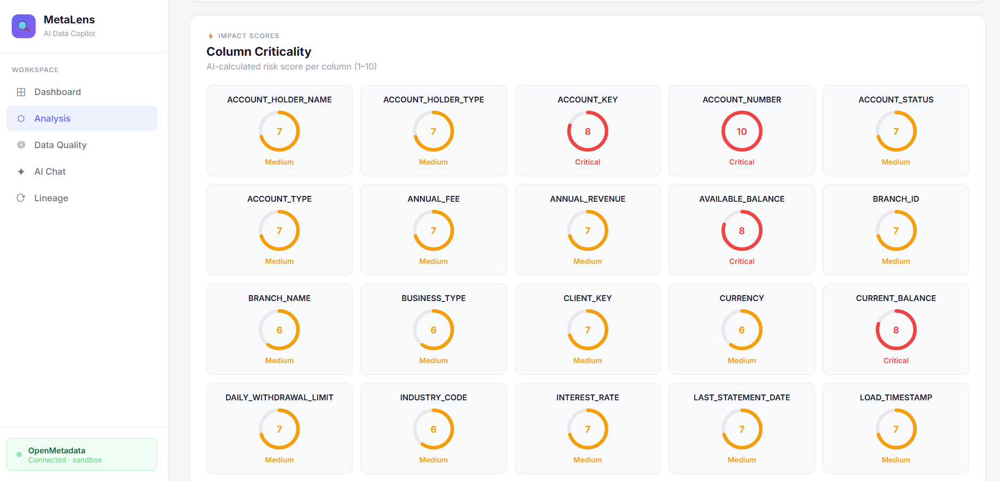

**4. Data Quality — Null penalties + PII exposure rolled into a single score**
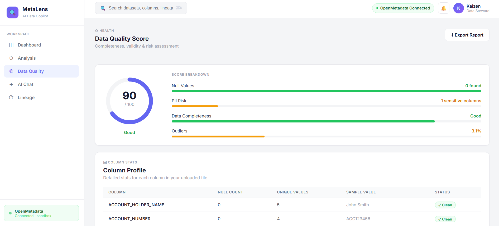

**5. AI Chat — Ask anything about your data; AI answers using metadata + profile**
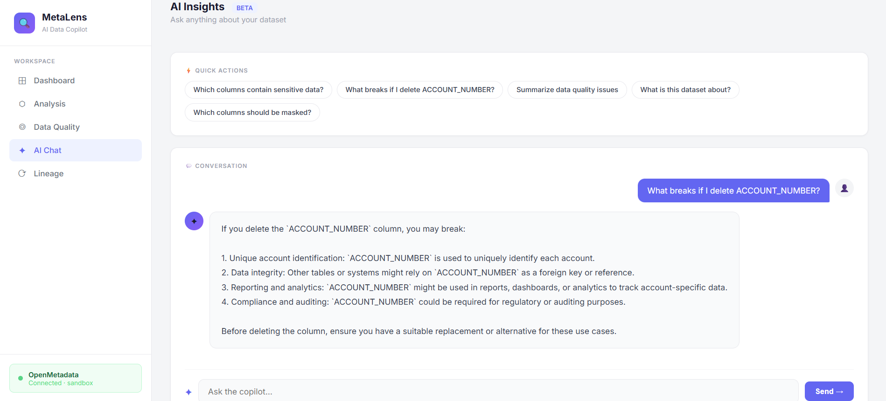 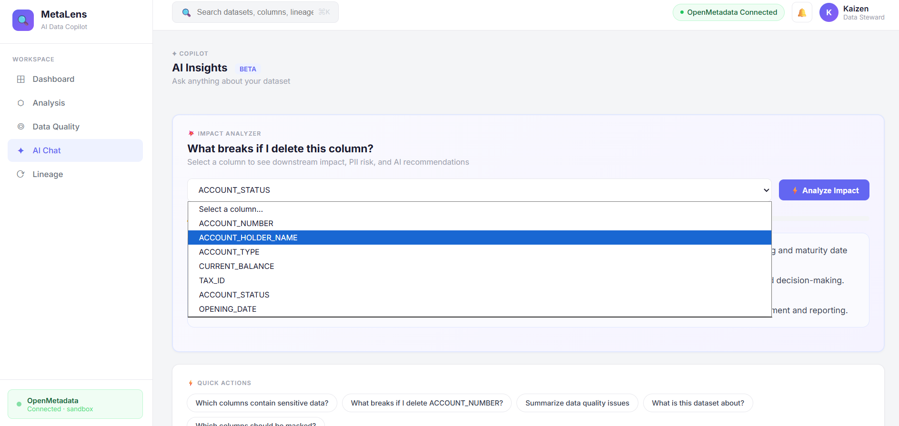

**6. Risk Score — "What breaks if I delete this column?" answered in seconds**
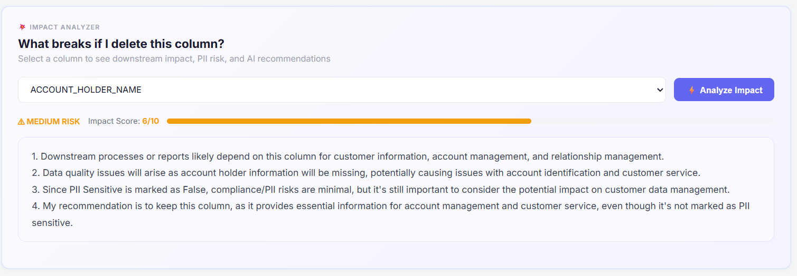

**7. Lineage — See where your data comes from and what depends on it**
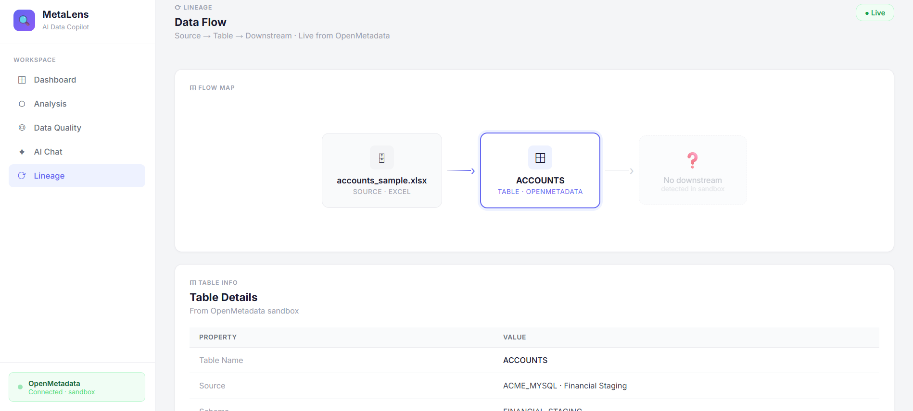 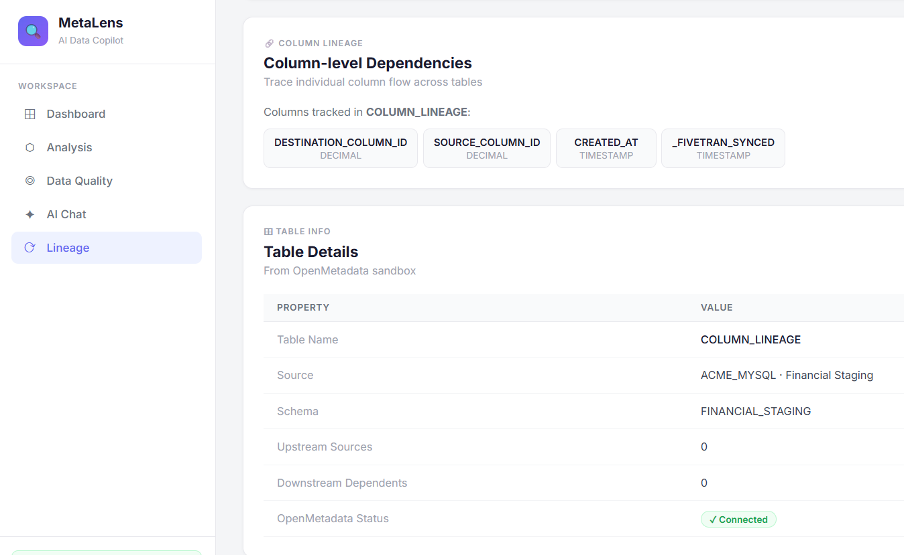

**8. Metadata Completeness — Every column graded on description, tags, type, sensitivity**
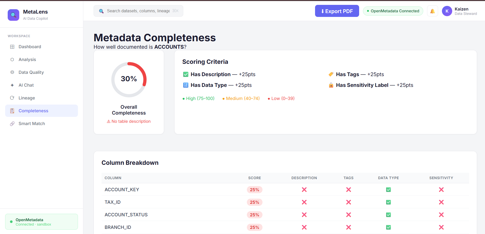

**9. Smart Match + PDF Export — Excel columns mapped to metadata; full report downloaded in one click**
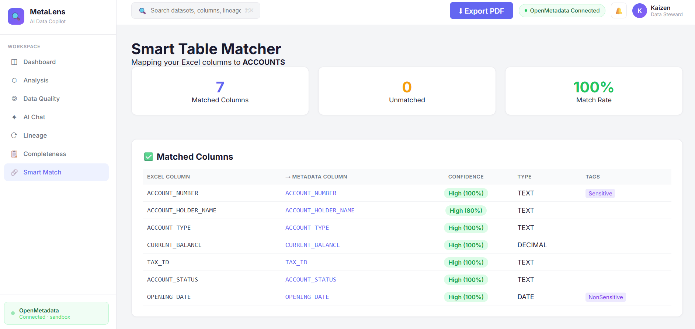
---

## 🏗 Tech Stack

| Layer | Technology |
|---|---|
| Backend | Python 3, Flask |
| Excel Parsing | pandas, openpyxl |
| Metadata | OpenMetadata REST API (sandbox) |
| AI | Groq API — LLaMA 3.3 70B |
| Frontend | Jinja2, custom CSS, Inter font |
| Deployment | Railway (gunicorn) |

---

## 🚀 Running Locally

```bash
# Clone the repo
git clone https://github.com/pratyakshyamishra43-coder/MetaLens.git
cd MetaLens

# Install dependencies
pip install -r requirements.txt

# Set up environment variables
cp .env.example .env
# Add your OPENMETADATA_TOKEN and GROQ_API_KEY to .env

# Run
python app.py
# Visit http://127.0.0.1:5000
```

---

## 🔑 Environment Variables
OPENMETADATA_TOKEN=your_90_day_personal_access_token
GROQ_API_KEY=your_groq_api_key

---

## 📁 Project Structure

```
MetaLens/
├── app.py
├── fetch_metadata.py
├── parse_excel.py
├── pipeline.py
├── requirements.txt
├── Procfile
├── .env.example
├── static/
│   └── style.css
├── templates/
│   ├── base.html
│   ├── index.html
│   ├── analysis.html
│   ├── quality.html
│   ├── chat.html
│   └── lineage.html
├── screenshots/
│   ├── dashboard.png
│   ├── analysis.png
│   ├── quality.png
│   ├── chat.png
│   └── lineage.png
└── accounts_sample.xlsx
```

---

## 🧠 How OpenMetadata Integration Works

MetaLens uses the OpenMetadata REST API to:
- Fetch table schema and column-level PII tags (`PII.Sensitive`, `PII.NonSensitive`)
- Pull upstream/downstream lineage edges
- Search across all tables in the catalog live
- Write table descriptions back to OpenMetadata (coming Apr 24)

Active demo table: `ACME_MYSQL.default.FINANCIAL_STAGING.ACCOUNTS`

---

## 🗓 Hackathon Build Log

| Date | Shipped |
|---|---|
| Apr 17–18 | Project setup, OpenMetadata auth, fetch_metadata.py |
| Apr 19–20 | Flask app, 5 pages, full UI, pipeline.py |
| Apr 21 | Railway deployment, table search, PII masking |
| Apr 22 | Column impact analyzer, DataSensitivity badges |
| Apr 23 | Column lineage, metadata completeness, smart matcher |
| Apr 24 | PDF export, description editor, compliance report |
| Apr 25 | Bulk PII scanner, demo video, final submission |

---

## 👨‍💻 Built By

**Pratyakshya Mishra ** — First year CS undergrad, India
Hackathon: WeMakeDevs x OpenMetadata | April 17–26, 2026 
